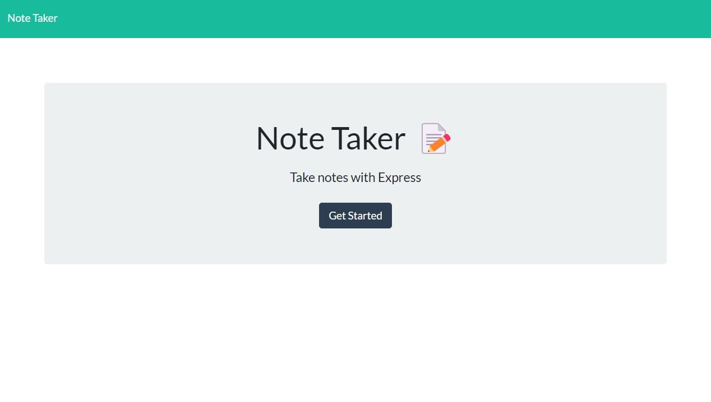
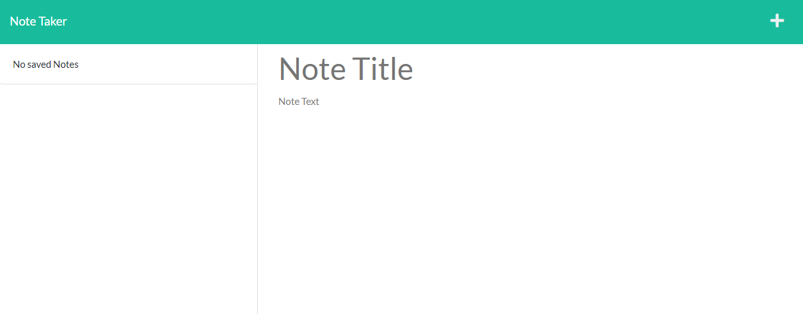
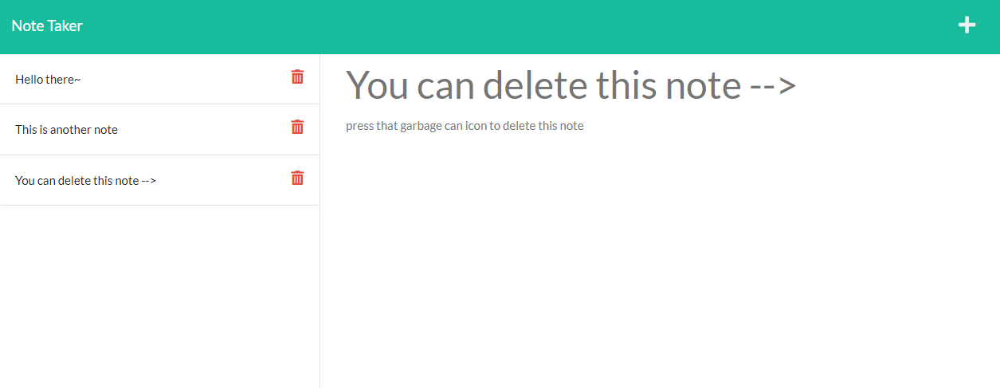

# A-Very-Green-Note-Taker

## Description

This project implements Express concepts to create an application that connects front-end and back-end developments.

This application allows the user to create notes, save notes, and also delete the notes.

This project helped me become more familiar with using Express and the Heroku application to deploy my application.

## Mock-Up

This following image shows a mock-up of the application:

This image below shows the note page of the applicaiton:

This image below shows the note page and a delete button for existing notes:

## Table of Contents

- [Installation](#installation)
- [Usage](#usage)
- [License](#license)
- [Badges](#badges)
- [Contributing](#how-to-contribute)
- [Credits](#credits)
- [Tests](#tests)
- [Author](#about-the-author)

## Installation

N/A

## Usage

To access this application, click [♡ here ♡](https://a-green-note-taker.herokuapp.com/) to visit the following URL: https://a-green-note-taker.herokuapp.com/

## License

This application is covered under the MIT license.
To view a description of this license type, refer to the repository or click [♡ here ♡](https://opensource.org/licenses/MIT).

## Badges

This application was made with JavaScript:

This application also uses HTML and CSS styling:

## How to Contribute

Ways to contribute include suggesting bug fixes.

## Credits

I received assistance for this project from a tutor and institution instructors ♡

## Tests

N/A

## About the Author

My name is Claire and I am a student learning Web Development.